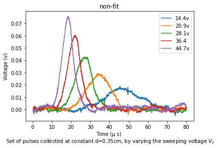

# Haynes-Shockley experiment (Module 2)
> [Haynes-Shockley-experiment-M1](https://github.com/SMNIK/Haynes-Shockley-experiment-M1)  
> The charge mobility in semiconductor materils.

It was the first experiment to measure directly the drift velocity, and thus mobility, of minority carriers. Previously the drift velocity was determined with the Hall effect, which was an direct method whose results could not be easily interpreted.
In the original H-S experiment an electric field is created along a small bar of a doped semiconductor (cut from a single crystal ingot) by applying an experimental voltage across the bar ends. Then a short pulse injects excess minority charge carriers into the sample which are successively swept along the bar by the electric field. By detecting and analyzing the excess-charge pulse during its travel, the drift velocity, the diffusion constant and lifetime may be calculated.
>
>#### More Study
><a href="https://www.labtrek.it/haynes-shockley-experiment/">labtrek</a> 
><a href="https://aip.scitation.org/doi/pdf/10.1063/1.334081">aip.scitation.org
></a>
>### Goals
>- Minority charge carrier amount.
>- the effect of the distance electrodes on the production of electrons and 
>holes.
>- measuring of carrier's lifetime.

>Block diagram for optical injection and point-contact collector

Important fields are: ***lifetime, drift velocity, electric field***

<h3>Measurement of the time of flight t</h3>

 Due to the constant of the distance and the moving fields, the flight time is also constant, which does not depend on the density of the laser pulse. so the spectrom just increases the peak of the graph relevant to the voltage. Despite the fact that t is grown by increasing inject charge density.

On the oscilloscope screen we may observe a first short negative pulse, with amplitude comparable to that of the injection pulse VI and, after some delay t, a second negative pulse, wider and much smaller than the first one. An example of the collected signal in a <em>N-doped</em> Ge sample, with posittive injecting and sweep pulses is shown below (here the excess injected carriers are holes, not electrons). 

The first peak is simultaneous with the injection pulse: it is due to the electromagnetic signal propagating across the sample. The second pulse (the top plot) corresponds to the excess-charge distribution passing under the collector contact: its shape is approximately <a href="https://en.wikipedia.org/wiki/Gaussian_function"><em>Gaussian</em></a> and its amplitude and width are determined by diffusion and recombination processes.
An analytical interpretation of the pulse shape, based on the solution of the time dependent diffusion equation, may be found in Gaussian coefficients. 

<h3>Measurment of drift velocity</h3>

  Es is an internal electric pulse field that produced by a pulsed generator. Distance between optical fiber and needle (<ins>point contact</ins>) is <em>d</em>.  Vs is the electrical pulls and Vl is the laser pulls. The lasr pulls causes 2 small peak between up and down main semiconductor peak. The second peak is the wider and relevant to minority carriers.

<!DOCTYPE html>
<html>
<head>
</head>
<body>
  <h3>Information that can be extracted from the pulse shape and position</h3>
  <table>
    <tr>
      <td>the drift velocity</td>
      <td></td>
    </tr>
      <tr>
    <td>sweep field (L : sample length)</td>
    <td></td>
  </tr>
    <tr>
        <td>so electron mobility is</td>
        <td></td>
    </tr>
    <tr>
        <td>then relation of Diffusion and collected pulse</td>
        <td></td>
  </tr>
</table>

 The semiconductor sample is a thin bar (approximately 3x3x30 mm) of single crystal ingot.

<em>photo electric effect (LASER beam) causes the drift mobility of minority charge carriers sweeps length of the semiconductor.</em> 
The excess charges may be generated by a light pulse (by exploiting the internal photoelectric effect) e.g. using a beam, produced by LASER diode, and the emitted light beam is guided by an optical fiber with one end replacing the emitter point contact.

</body>
</html>

# Project Structure
The below configuration, explains how to use the codes and change them for your data:
> the 3 simple steps

1) The first step is prepaire the excel file ready as the x and y column's header.Then, plot your data by colling matplot library ([plotting.py](https://github.com/SMNIK/Haynes-Shockley-experiment-M2/blob/master/plot.py)). 
2) The plot shows us the peak of minority mobility of sample which the scale is voltage per time. As we know, these data involves noises and we need to excract the usful data. Use one of the fit configurations and calculate the coefficients. Here I used the [Gaussian](https://en.wikipedia.org/wiki/Gaussian_function) fit ([fitPlot.py](https://github.com/SMNIK/Haynes-Shockley-experiment-M2/blob/master/fit-plot.py)).
3) Finally, users should use the above files for as many he wants to plot and calculates the coefficients. And, import them to the final file and prepare the final table and figure.

***This is helpful notes to clarify that how my testing code works***
- you could use the file [plottin.py](https://github.com/SMNIK/Haynes-Shockley-experiment-M2/blob/master/plot.py) to plot your data for as many different voltage you need. You could use the [Module 1](https://github.com/SMNIK/Haynes-Shockley-experiment-M1), however, in conclusion I will explaine the differences.
- As we know, in this experiment, data contains noise of staffs, so, we need to prepaire the fit result as the new data for calculating the mobility, mean free path, and fly time. From [fitPlot.py](https://github.com/SMNIK/Haynes-Shockley-experiment-M2/blob/master/fit-plot.py), call your data and then you can fit the peaks by Gaussian method and extract the coefficients for calculation.
- And in [coefficientsTable.py](https://github.com/SMNIK/Haynes-Shockley-experiment-M2/blob/master/coefficientsTable.py), call the coefficients, check if the name of sheet is true, prepare the new excel file and extract your fit's data in different index. And, plot the logarithmic Area per time to modify the fit line for different voltage.
- In [testing.py](https://github.com/SMNIK/Haynes-Shockley-experiment-M2/blob/master/testing.py), I call all my sheets and for each List I use different index. Finally, arrange your table and plot the last figure which I explaine in the above part.

## Conclusion

> differences between M1 and M2 are : 
> in M1 you should calculate each voltage in seperat file, but M2 calculate all sheets (voltages) in on touche.
> because of seperating files in M1, you can change each part as you prefer, but in M2 may be appeares error.
> M1 is a sample of how the libraries in python work, for example we call plotting inside the fitPlot. However, in M2 it is not the same. The benefites of this method is that may be our library would be useful for other users.
> [Module 1](https://github.com/SMNIK/Haynes-Shockley-experiment-M1)

***At the end some results***

